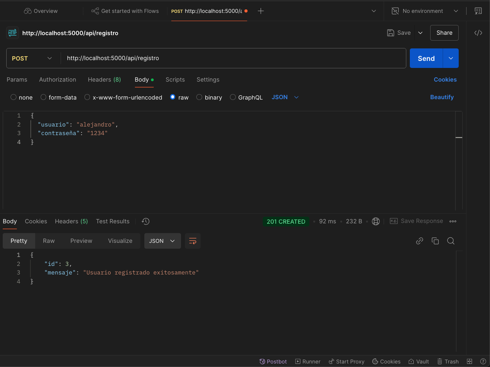
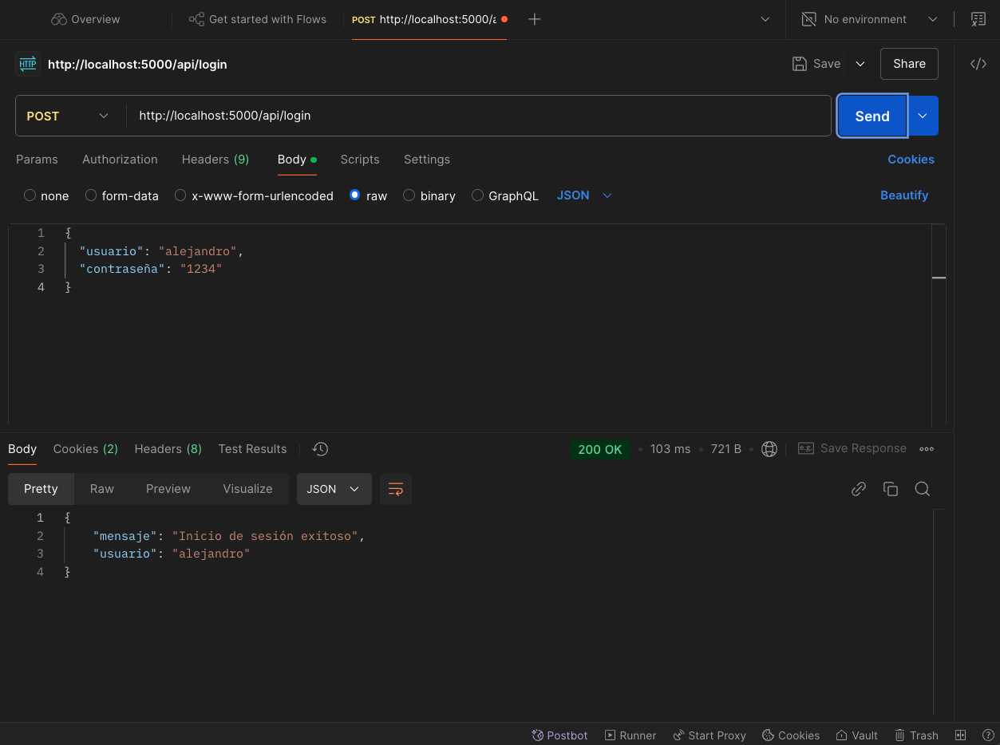
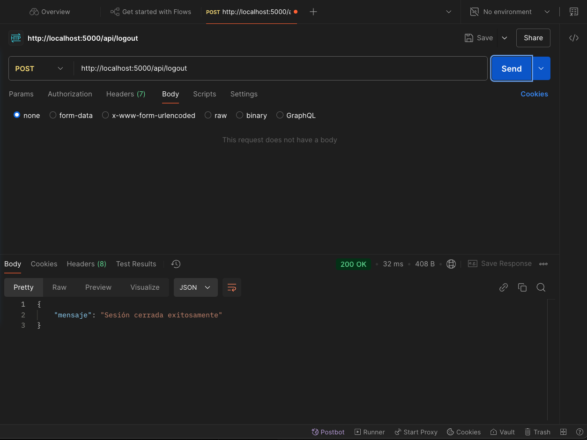
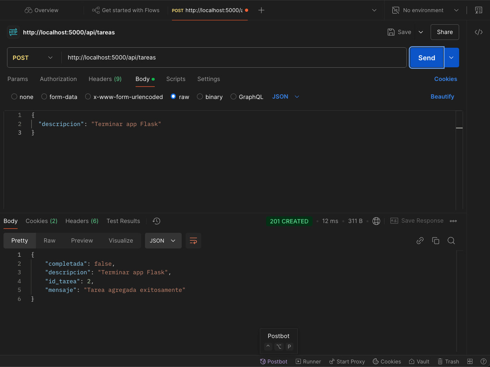
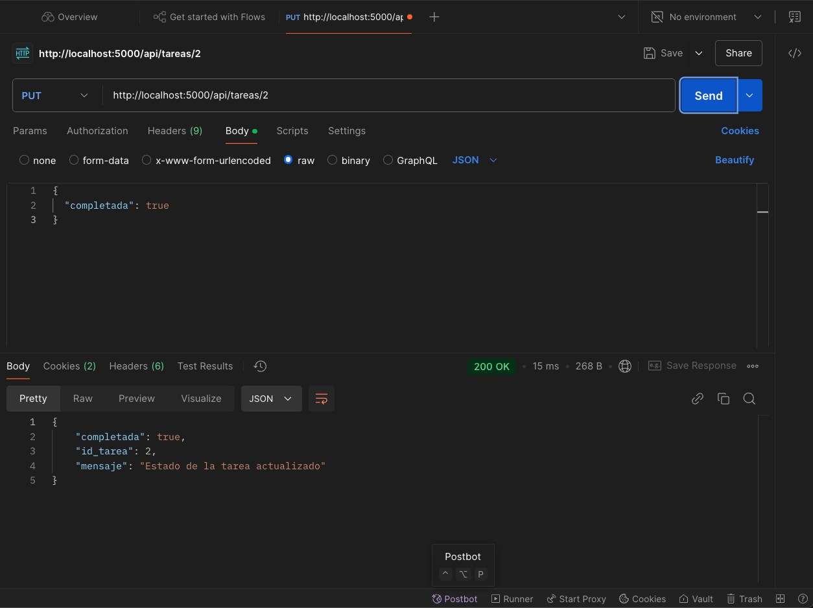
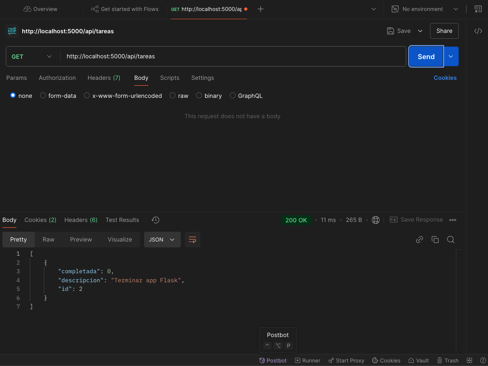
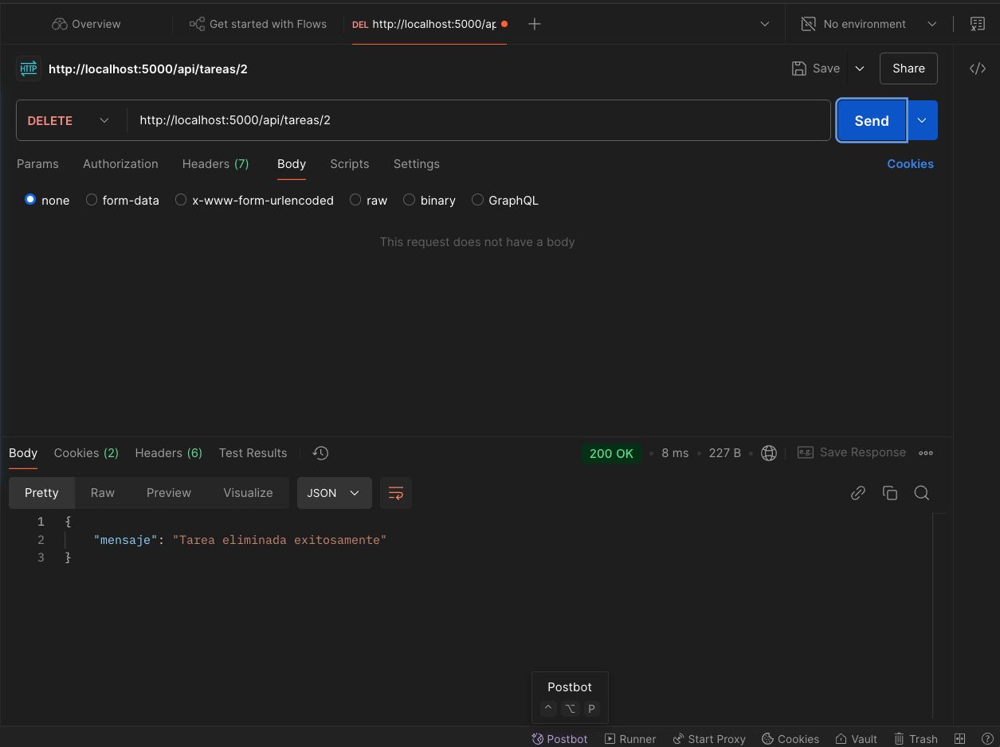

# Aplicación de Gestión de Tareas (API Flask + CLI)

Esta es una aplicación para la gestión de tareas personales, compuesta por una API RESTful desarrollada con Flask y un cliente de interfaz de línea de comandos (CLI) en Python para interactuar con ella.

## Arquitectura

-   **API Backend (Flask):** `app.py`
    -   Provee endpoints JSON para todas las operaciones: autenticación de usuarios y gestión de tareas (CRUD).
    -   Utiliza Flask-Login para la gestión de sesiones basadas en cookies.
    -   Almacena datos en una base de datos SQLite (`usuarios.db`) con contraseñas hasheadas (Werkzeug).
-   **Cliente CLI (Python):** `cli.py`
    -   Ofrece un menú interactivo para registrarse, iniciar sesión, listar, agregar y eliminar tareas, y cerrar sesión.
    -   Se comunica con la API Flask usando la librería `requests`.
    -   Maneja la cookie de sesión para mantener al usuario autenticado entre comandos.

## Características Principales

-   **Autenticación de Usuarios (vía API, gestionada por CLI):**
    -   Registro de nuevos usuarios.
    -   Inicio de sesión.
    -   Cierre de sesión.
-   **Gestión de Tareas (vía API, gestionada por CLI):**
    -   Listar tareas personales.
    -   Agregar nuevas tareas.
    -   Eliminar tareas.
    -   Actualizar estado de tareas (completada/pendiente).
-   **Interfaz de Línea de Comandos:**
    -   Menús interactivos para todas las funcionalidades.
    -   Mensaje de bienvenida en formato HTML (`<html><body><h1>Bienvenido</h1></body></html>`) en la consola tras un login exitoso.

## Requisitos Previos

-   Python 3.x
-   pip (manejador de paquetes de Python)

## Configuración del Entorno

1.  **Clona el repositorio (si aplica) o descarga los archivos.**

2.  **Navega al directorio del proyecto:**
    ```bash
    cd ruta/a/tu/proyecto
    ```

3.  **Crea un entorno virtual (recomendado):**
    ```bash
    python -m venv venv
    source venv/bin/activate  # En Windows: venv\Scripts\activate
    ```

4.  **Instala las dependencias:**
    ```bash
    pip install -r requirements.txt
    ```
    Esto instalará Flask, Werkzeug, Flask-Login y Requests.

5.  **Prepara la base de datos:**
    Ejecuta el script para crear las tablas de `usuarios` y `tareas`.
    ```bash
    python database_setup.py
    ```
    Esto creará `usuarios.db` si no existe y las tablas necesarias.

## Ejecución de la Aplicación

La aplicación consta de dos partes que deben ejecutarse: la API Flask y el Cliente CLI.

### 1. Iniciar la API Flask

Abre una terminal y ejecuta:
```bash
python app.py
```
El servidor API se iniciará por defecto en `http://127.0.0.1:5000`. Déjalo corriendo en esta terminal.

### 2. Usar el Cliente CLI

Abre **otra terminal** y ejecuta:
```bash
python cli.py
```
Aparecerá un menú interactivo. Sigue las instrucciones en pantalla:

-   **Menú Inicial:**
    1.  **Registrarse:** Proporciona un nombre de usuario y contraseña para crear una cuenta.
    2.  **Iniciar Sesión:** Ingresa tus credenciales. Si es exitoso, verás un mensaje de bienvenida HTML y accederás al menú de usuario.
    3.  **Salir:** Termina la aplicación CLI.

-   **Menú de Usuario (después de iniciar sesión):**
    1.  **Listar tareas:** Muestra todas tus tareas con su ID, descripción y estado.
    2.  **Agregar tarea:** Pide una descripción y crea una nueva tarea.
    3.  **Eliminar tarea:** Pide el ID de la tarea a eliminar.
    4.  **Logout:** Cierra tu sesión y regresa al menú inicial.

## Endpoints de la API Flask

La CLI interactúa con los siguientes endpoints. También puedes probarlos con herramientas como `curl` o Postman, pero recuerda manejar las cookies de sesión para los endpoints que requieren autenticación.

-   **Autenticación:**
    -   `POST /api/registro`
        -   Cuerpo: `{"usuario": "nombre", "contraseña": "123"}`
        -   Respuesta (Éxito 201): `{"mensaje": "Usuario registrado...", "id": X}`
    -   `POST /api/login`
        -   Cuerpo: `{"usuario": "nombre", "contraseña": "123"}`
        -   Respuesta (Éxito 200): `{"mensaje": "Inicio de sesión exitoso", "usuario": "nombre"}` (Establece cookie de sesión)
    -   `POST /api/logout` (Requiere cookie de sesión)
        -   Respuesta (Éxito 200): `{"mensaje": "Sesión cerrada exitosamente"}`

-   **Tareas (Todos requieren cookie de sesión):**
    -   `GET /api/tareas`
        -   Respuesta (Éxito 200): `[{"id": X, "descripcion": "...", "completada": false/true, "usuario_id": Y}, ...]`
    -   `POST /api/tareas`
        -   Cuerpo: `{"descripcion": "Nueva tarea"}`
        -   Respuesta (Éxito 201): `{"mensaje": "Tarea agregada...", "id_tarea": X, ...}`
    -   `DELETE /api/tareas/<id_tarea>`
        -   Respuesta (Éxito 200): `{"mensaje": "Tarea eliminada exitosamente"}`
        -   Respuesta (Error 404): `{"error": "Tarea no encontrada..."}`
    -   `PUT /api/tareas/<id_tarea>`
        -   Cuerpo: `{"completada": true/false}`
        -   Respuesta (Éxito 200): `{"mensaje": "Estado de la tarea actualizado", ...}`
        -   Respuesta (Error 404): `{"error": "Tarea no encontrada..."}`

-   **Estado:**
    -   `GET /api/status` (Requiere cookie de sesión)
        -   Respuesta (Éxito 200): `{"autenticado": true, "usuario_id": X, "usuario": "nombre"}`

En caso de no estar autenticado y tratar de acceder a un endpoint protegido, la API devolverá un error 401:
`{"error": "Acceso no autorizado. Por favor, inicia sesión."}`

## Archivos del Proyecto

-   `app.py`: Servidor API Flask.
-   `cli.py`: Cliente de interfaz de línea de comandos.
-   `database_setup.py`: Script para configurar la base de datos.
-   `requirements.txt`: Dependencias de Python.
-   `usuarios.db`: Archivo de la base de datos SQLite (creado por `database_setup.py`).
-   `README.md`: Este archivo.

## Verificación con Postman

#### Registrarse


#### Iniciar sesión


#### Cerrar sesión


#### Agregar una tarea en la CLI


#### Actualizar tareas


#### Listado de tareas en la CLI


#### Eliminar una tarea en la CLI


## Posibles Mejoras Futuras

-   Mejorar el manejo de errores en la CLI (ej. conexión a la API).
-   Empaquetar la CLI para una instalación más fácil.
-   Persistencia de la sesión de la CLI entre ejecuciones (opcional).
-   Agregar una interfaz web